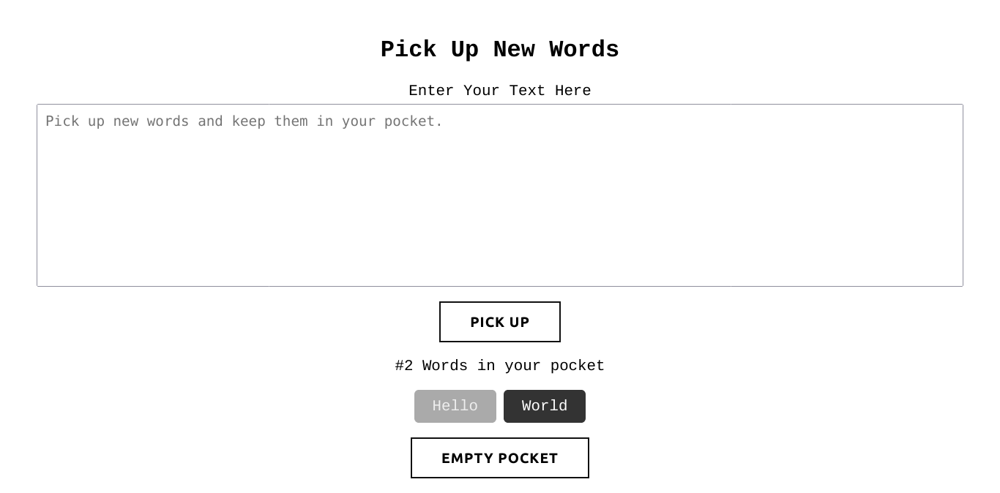

# Words Pocket (For English Learners)

**Paste your text, the repeated words will be deleted and saved in your pocket so you can memorize them when you want.**

### Features:

- You can select the words that you have finished memorizing.
- You can empty the words in the pocket.

### Live Screenshot

### Demo:

https: https://muhammad-adam778.github.io/Words_Pocket/

### Built with ⚒️

- HTML5 (Semantic)
- CSS (Flexbox)
- JS (LocalStorage)

### Author

- Linkedin: [@muhammad-adam778](https://www.linkedin.com/in/muhammad-adam778/)

**Please report issues**
